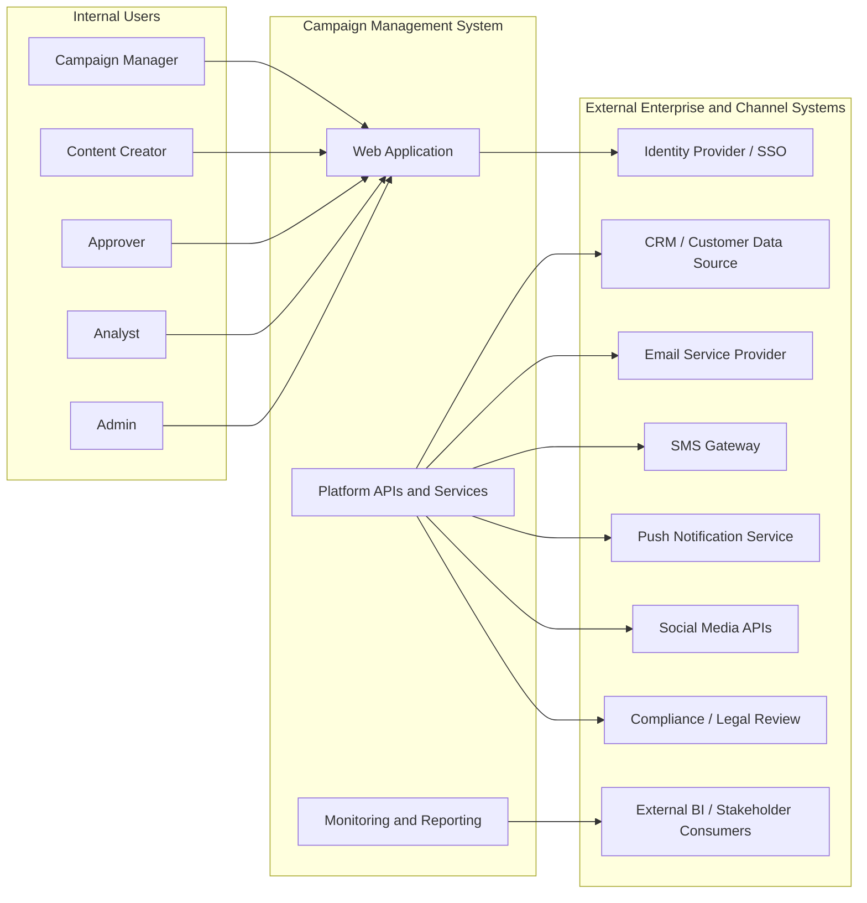
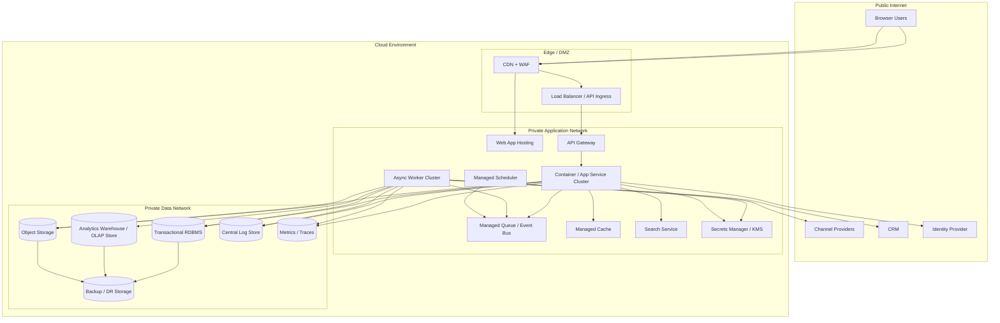
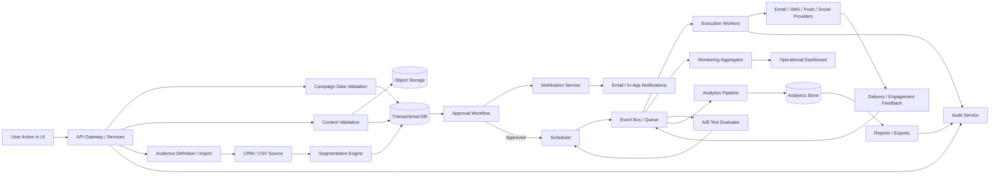
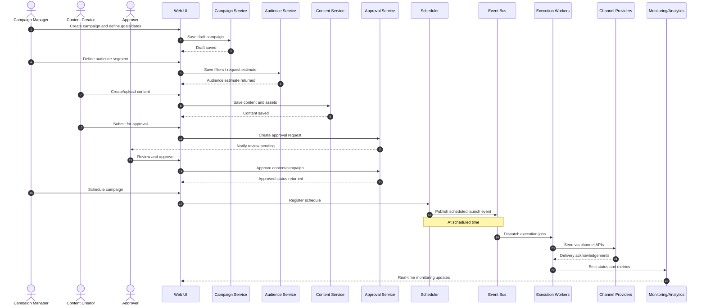
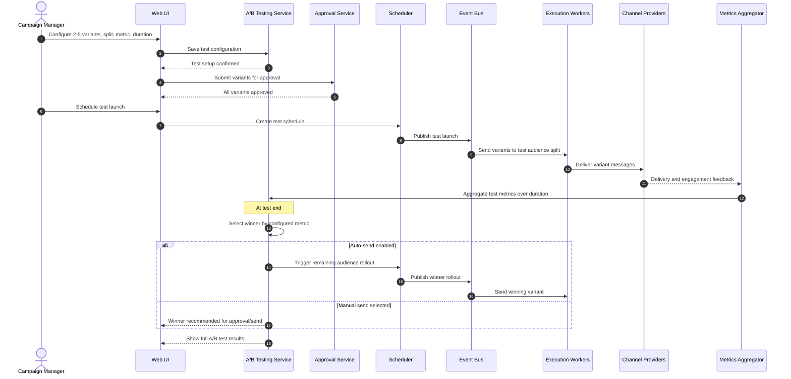
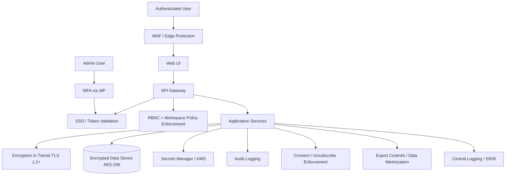
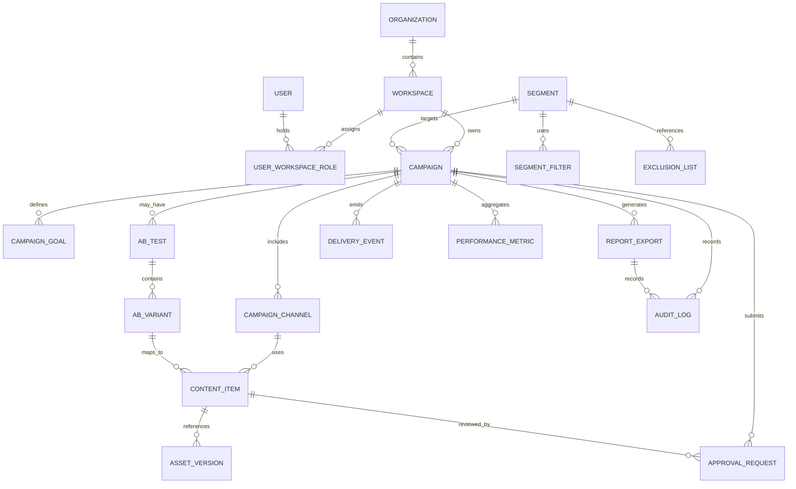
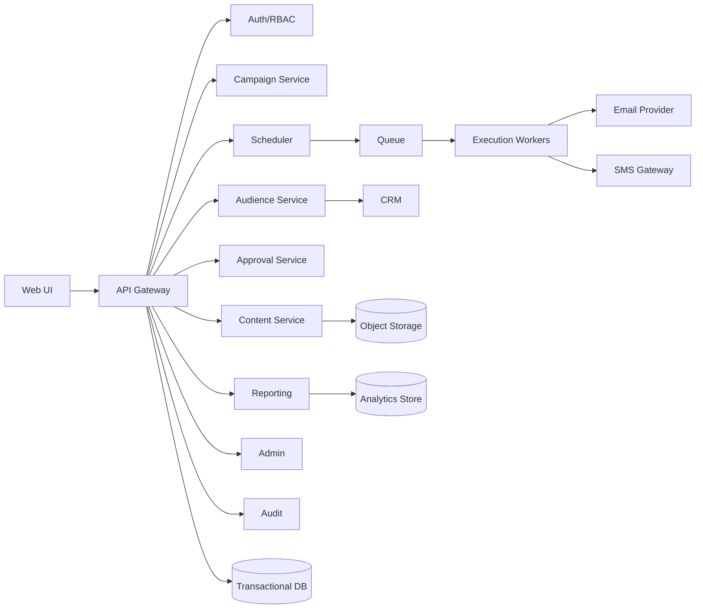
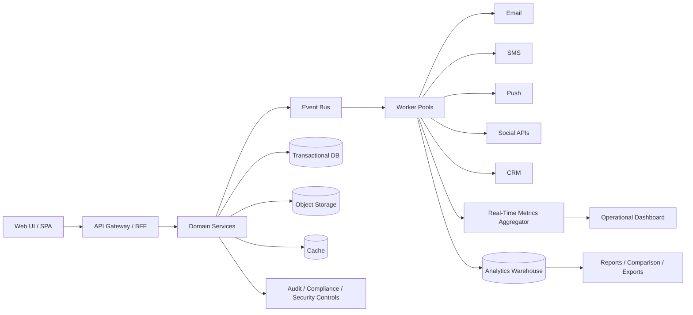

# Campaign Management System - Architecture Plan

## Executive Summary

The Campaign Management System (CMS) is a web-based, multi-workspace platform for planning, approving, scheduling, executing, monitoring, and analyzing marketing campaigns across email, SMS, push notifications, and social media. It centralizes the campaign lifecycle so marketing teams can collaborate in one governed environment instead of switching among disconnected tools.

The recommended architecture is a cloud-native, service-oriented platform with clear separation between:
- user-facing campaign planning workflows,
- asynchronous orchestration and outbound delivery,
- operational monitoring and alerting,
- analytical reporting and long-term retention,
- security, compliance, and audit controls.

Because the functional scope includes multi-channel execution, approvals, A/B testing, CRM integration, real-time monitoring, exports, consent enforcement, and high-volume delivery requirements of up to 10 million sends per day, a phased approach is advisable:
- **Phase 1** focuses on core planning, approvals, scheduling, email/SMS execution, dashboards, and governance.
- **Phase 2+** expands to full omnichannel support, advanced experimentation, richer automation, and scale optimizations.

The target architecture prioritizes:
- **Scalability** through stateless services, queues, event-driven processing, and elastic workers
- **Performance** through caching, pre-aggregated analytics, and separation of transactional and analytical workloads
- **Security** via SSO, RBAC, workspace isolation, encryption, secrets management, and audit trails
- **Reliability** through retries, dead-letter queues, rate control, failure isolation, and observability
- **Maintainability** through bounded services, standard integration patterns, and clear operational ownership

---

## System Context

### System Context Diagram

### Explanation

#### Overview
This diagram shows the Campaign Management System in its broader enterprise ecosystem. It identifies the internal user roles, the CMS system boundary, and the external enterprise and delivery systems the platform depends on.

#### Key Components
- **Internal Users**: Campaign Manager, Content Creator, Approver, Analyst, and Admin
- **CMS**: Web application, platform APIs/services, and monitoring/reporting capabilities
- **Identity Provider**: Enterprise SSO for authentication
- **CRM**: Source of contact data, attributes, and audience import
- **Channel Providers**: ESP, SMS gateway, push provider, and social APIs for outbound execution
- **External BI / Stakeholders**: Consumers of exported reports
- **Compliance / Legal**: Policy and retention governance influence, even if not a direct runtime integration in all cases

#### Relationships
- Users interact with the platform via the web application.
- Authentication is delegated to the enterprise identity provider.
- Audience and customer attributes are synchronized or queried from CRM.
- The CMS sends outbound campaigns through specialized external channel providers.
- Reports and exports are consumed by analysts and external stakeholders.
- Compliance requirements shape unsubscribe handling, auditability, and retention policies.

#### Design Decisions
- **Web-based architecture** aligns with the explicit constraint of browser-only access.
- **Externalized identity** avoids duplicating corporate authentication and centralizes access governance.
- **Provider-based delivery integration** reflects the assumption that the organization already owns ESP, SMS, and social accounts.
- **Platform boundary around governance and orchestration** keeps core business logic inside CMS while leveraging best-of-breed delivery systems.

#### NFR Considerations
- **Scalability**: High-volume outbound delivery is delegated to elastic provider integrations and asynchronous execution.
- **Performance**: Operational UI is separated from provider execution; audience sizing and reporting can be optimized independently.
- **Security**: SSO, provider credential isolation, and controlled external integration boundaries reduce exposure.
- **Reliability**: External delivery failures are isolated from core planning and approval workflows.
- **Maintainability**: Clear boundaries enable providers to be swapped or added with minimal impact on internal workflows.

#### Trade-offs
- Relying on external delivery providers accelerates time to market but increases dependency on provider capabilities and SLAs.
- Deep CRM integration improves targeting quality but adds schema mapping and synchronization complexity.

#### Risks and Mitigations
- **Risk**: API limits or outages from external providers  
  **Mitigation**: Queue-based retries, circuit breakers, throttling, and failover runbooks.
- **Risk**: Inconsistent CRM data quality  
  **Mitigation**: Data validation, import checks, segmentation previews, and reconciliation monitoring.
- **Risk**: Authentication requirements change after SSO provider selection  
  **Mitigation**: Use standards-based OIDC/SAML abstraction and configurable identity adapters.

---

## Architecture Overview

The recommended architecture uses a **modular service-oriented pattern with event-driven execution**.

### Core architectural patterns
- **Modular domain services** for campaigns, audiences, content, approvals, scheduling, reporting, and administration
- **API-first backend** behind a secure gateway
- **Event-driven orchestration** for scheduling, launch, delivery feedback, notifications, and A/B test progression
- **Asynchronous workers** for outbound delivery, validation, imports, exports, and aggregation
- **CQRS-lite separation** between transactional data paths and analytics/reporting queries
- **Multi-tenant workspace isolation** within a single organization account model
- **Compliance-by-design controls** for consent, unsubscribe, retention, and auditability

### Primary domain capabilities
1. **Campaign lifecycle management**
2. **Audience segmentation and CRM ingestion**
3. **Content and asset management**
4. **Approval workflow and notifications**
5. **Schedule and execution orchestration**
6. **A/B test management**
7. **Monitoring, analytics, and reporting**
8. **Workspace, user, and integration administration**

### High-level architecture principles
- Keep the UI responsive by offloading heavy operations to background processes.
- Isolate transactional workflows from analytical workloads.
- Store immutable audit and event history for operational traceability.
- Enforce permissions and workspace scope at every API and data access layer.
- Make integrations adapter-based so channel providers can evolve independently.

---

## Component Architecture

### Component Diagram

```mermaid
flowchart TB
    UI[Web UI / SPA]

    AGW[API Gateway / BFF]

    AUTH[Auth & Access Service]
    CAMP[Campaign Service]
    AUD[Audience Service]
    CONT[Content & Asset Service]
    APPR[Approval Workflow Service]
    SCHED[Scheduling & Orchestration Service]
    EXEC[Channel Execution Service]
    ABT[A/B Testing Service]
    NOTIF[Notification Service]
    RPT[Reporting & Analytics Service]
    ADMIN[Workspace & Admin Service]
    AUDIT[Audit & Compliance Service]
    INTEG[Integration Adapter Layer]

    DB1[(Transactional DB)]
    DB2[(Analytics Store)]
    OBJ[(Object Storage)]
    CACHE[(Cache)]
    MQ[(Event Bus / Queue)]
    SEARCH[(Search / Index)]

    UI --> AGW
    AGW --> AUTH
    AGW --> CAMP
    AGW --> AUD
    AGW --> CONT
    AGW --> APPR
    AGW --> SCHED
    AGW --> RPT
    AGW --> ADMIN
    AGW --> AUDIT

    CAMP --> DB1
    AUD --> DB1
    CONT --> DB1
    CONT --> OBJ
    CONT --> SEARCH
    APPR --> DB1
    SCHED --> DB1
    EXEC --> DB1
    ABT --> DB1
    ADMIN --> DB1
    AUDIT --> DB1
    RPT --> DB2

    AUD --> CACHE
    RPT --> CACHE

    CAMP --> MQ
    APPR --> MQ
    SCHED --> MQ
    EXEC --> MQ
    ABT --> MQ
    NOTIF --> MQ
    RPT --> MQ
    AUDIT --> MQ

    AUD --> INTEG
    EXEC --> INTEG
    NOTIF --> INTEG
    RPT --> INTEG
```

### Explanation

#### Overview
This diagram shows the major logical components of the CMS, their responsibilities, and their interactions with shared platform infrastructure such as databases, queues, cache, object storage, and external integrations.

#### Key Components
- **Web UI / SPA**: Browser-based application for all roles
- **API Gateway / BFF**: Single entry point for frontend calls, request routing, response shaping, and policy enforcement
- **Auth & Access Service**: SSO integration, RBAC, workspace scoping, session/token validation
- **Campaign Service**: Campaign definitions, lifecycle state, goals, parent-child grouping, duplication
- **Audience Service**: Segments, exclusions, audience size estimates, CRM imports, CSV uploads
- **Content & Asset Service**: Templates, asset library, previews, version history, validation
- **Approval Workflow Service**: Review queue, approval/rejection/comments, approval history
- **Scheduling & Orchestration Service**: Timed launches, recurring sends, pause/resume, launch control
- **Channel Execution Service**: Provider-specific outbound delivery orchestration and status tracking
- **A/B Testing Service**: Variant management, split logic, winner determination, rollout decisioning
- **Notification Service**: Email and in-app alerts for approvals, failures, launches, completions
- **Reporting & Analytics Service**: Real-time dashboards, historical reports, exports, comparisons
- **Workspace & Admin Service**: Users, roles, workspaces, integration configuration
- **Audit & Compliance Service**: Immutable audit records, export logs, consent and policy evidence
- **Integration Adapter Layer**: Connectors for CRM, channel providers, and future systems

#### Relationships
- The UI accesses the platform through the API gateway rather than calling services directly.
- Domain services persist transactional state in the primary database.
- High-volume and asynchronous activities flow through the event bus/queue.
- Reporting consumes event streams and transactional outputs into a separate analytics store.
- Content assets are stored in object storage while metadata stays in the transactional database.
- Search/indexing supports approval queues, asset discovery, and campaign lookup.
- Integration adapters standardize connectivity to external systems.

#### Design Decisions
- **API Gateway/BFF** improves client simplicity and centralizes policy enforcement.
- **Separate analytics store** protects dashboard performance and prevents analytical queries from affecting operational transactions.
- **Object storage for assets** is more efficient for versioned binary files than relational storage.
- **Queue-based processing** is required for 10 million sends/day and for provider resilience.
- **Adapter layer** decouples internal workflows from vendor-specific APIs.

#### NFR Considerations
- **Scalability**: Stateless services scale horizontally; workers scale independently by queue depth; analytics scales separately.
- **Performance**: Cache accelerates audience sizing and dashboard reads; search index improves queue and asset lookup.
- **Security**: Access service centralizes RBAC and workspace filtering; audit service ensures traceability.
- **Reliability**: Event bus enables retries and failure isolation; services can degrade independently.
- **Maintainability**: Domain separation supports clearer ownership and safer change velocity.

#### Trade-offs
- A service-oriented design is more operable at scale than a monolith, but adds deployment and observability complexity.
- Separate data stores improve performance but introduce eventual consistency between operational and analytical views.

#### Risks and Mitigations
- **Risk**: Service sprawl and operational overhead  
  **Mitigation**: Start with modular services on a shared platform and split only where scale or team autonomy justifies it.
- **Risk**: Reporting lag due to asynchronous pipelines  
  **Mitigation**: Publish data freshness indicators and maintain a small real-time metrics path for active campaigns.
- **Risk**: Queue backlogs during peak launch windows  
  **Mitigation**: Autoscaling workers, rate-aware scheduling, and priority queues for critical workflows.

---

## Deployment Architecture

### Deployment Diagram

### Environment Strategy

- **Development**: Lower-scale environment with synthetic data, mocked or sandbox provider integrations, and relaxed non-production quotas
- **Staging**: Production-like environment for integration, performance, and release validation
- **Production**: Multi-AZ, autoscaled, monitored environment with hardened network and access policies

### Explanation

#### Overview
This diagram illustrates the logical deployment model for the CMS in a cloud environment, including edge security, application runtime, worker execution, data stores, observability, and integration boundaries.

#### Key Components
- **CDN + WAF**: Caches static content, blocks common web attacks, and protects ingress
- **Web App Hosting**: Serves the browser application
- **API Gateway / Ingress**: Terminates inbound API traffic and applies policy
- **App Service Cluster**: Runs synchronous user-facing APIs
- **Worker Cluster**: Handles asynchronous jobs such as imports, sends, validation, notification dispatch, and exports
- **Managed Scheduler**: Triggers scheduled and recurring campaigns
- **Event Bus / Queue**: Buffers high-volume workloads and integration events
- **Transactional DB**: Source of truth for campaigns, approvals, workspace metadata, and audit references
- **Analytics Store**: Serves dashboards, comparisons, and export workloads
- **Object Storage**: Assets, export files, possibly report artifacts
- **Central Logs / Metrics / Traces**: Observability foundation
- **Secrets Manager / KMS**: Protects credentials, API keys, and encryption keys
- **Backup / DR Storage**: Supports recovery objectives

#### Relationships
- User traffic enters via CDN/WAF and then reaches either the web application or API ingress.
- Synchronous APIs run in the app cluster; asynchronous and high-volume tasks run in worker nodes.
- The scheduler places due jobs onto the event bus.
- Workers handle channel delivery, CRM sync, and analytics aggregation.
- All critical components emit logs, metrics, and traces.

#### Design Decisions
- **Private network separation** between application and data planes reduces lateral movement risk.
- **Managed cloud primitives** reduce undifferentiated operational burden and improve resilience.
- **Worker separation from synchronous APIs** prevents delivery spikes from degrading user-facing operations.
- **Edge protection** is essential because the platform is browser-accessible over the public internet.

#### NFR Considerations
- **Scalability**: Workers and APIs scale independently; queue depth drives autoscaling.
- **Performance**: CDN improves frontend performance; private network latency remains low for backend calls.
- **Security**: WAF, private subnets, secrets management, and least-privilege network rules protect sensitive data.
- **Reliability**: Multi-AZ managed services, backups, and queue durability improve availability.
- **Maintainability**: Standardized deployment topology across environments reduces operational drift.

#### Trade-offs
- Managed services speed delivery and improve resilience, but may increase cloud spend and vendor dependence.
- Multiple network zones improve security posture, but add platform configuration complexity.

#### Risks and Mitigations
- **Risk**: Misconfigured network or ingress rules expose internal services  
  **Mitigation**: Infrastructure baselines, policy-as-code, regular security reviews, and automated compliance checks.
- **Risk**: Single-region outage impacts availability  
  **Mitigation**: Define DR strategy, cross-region backups, and optional warm standby for critical workloads.
- **Risk**: Provider sandbox differs materially from production behavior  
  **Mitigation**: Staging with production-like limits and contract testing against provider APIs.

---

## Data Flow

### Data Flow Diagram

### Explanation

#### Overview
This diagram shows how data moves through the system from campaign definition and audience setup through approvals, scheduling, execution, feedback capture, monitoring, analytics, exports, and audit.

#### Key Components
- **Validation steps** for campaign, content, and audience
- **Segmentation engine** for target and exclusion list resolution
- **Approval workflow** before launch
- **Scheduler and queue** for asynchronous execution
- **Execution workers** for provider dispatch
- **Feedback ingestion** for delivery and engagement metrics
- **Monitoring and analytics pipelines** for operational visibility and reporting
- **Audit service** for immutable accountability

#### Relationships
- Campaign and content definitions enter via the UI and are validated before persistence.
- Audience data is derived from CRM or CSV and stored as segment definitions and resolved audiences.
- Approved campaigns are scheduled and converted into execution jobs.
- Channel providers emit delivery and engagement events that are fed back into the platform.
- Events are used by both operational monitoring and longer-term analytics/reporting.

#### Design Decisions
- **Event-based feedback processing** supports near-real-time monitoring while accommodating provider-specific webhook patterns.
- **Validation before approval and before send** reduces compliance and quality risks.
- **Separate monitoring and reporting outputs** allows low-latency active-campaign visibility without overloading historical analytics paths.
- **Audit capture at multiple stages** ensures traceability for create, update, approve, export, and delivery-control actions.

#### NFR Considerations
- **Scalability**: Queue-based fan-out handles spikes in send volumes and feedback events.
- **Performance**: Preprocessing and aggregation pipelines support the 3-second dashboard/report requirement.
- **Security**: Sensitive audience data is validated, minimized, and stored under access controls; feedback ingestion is authenticated.
- **Reliability**: Durable eventing reduces data loss; retries and dead-letter handling protect against transient failures.
- **Maintainability**: Clearly separated data paths simplify troubleshooting and evolution.

#### Trade-offs
- Real-time dashboards depend on fast ingestion pipelines, which can increase infrastructure complexity.
- Storing both operational and analytical views increases cost but improves user experience and isolation.

#### Risks and Mitigations
- **Risk**: Duplicate or late provider callbacks distort metrics  
  **Mitigation**: Idempotent event handling, event timestamps, deduplication keys, and watermarking.
- **Risk**: Audience mismatches between estimate and actual send set  
  **Mitigation**: Snapshot resolved audience at launch and show users final send counts.
- **Risk**: Export jobs become resource-intensive  
  **Mitigation**: Run exports asynchronously, cache common datasets, and limit parallel large exports.

---

## Key Workflows

### Sequence Diagram 1: Create, Approve, Schedule, and Launch a Campaign

### Explanation

#### Overview
This sequence shows the end-to-end lifecycle of a standard campaign from draft creation to approved launch and operational monitoring.

#### Key Components
- Campaign Manager, Content Creator, Approver
- Campaign, Audience, Content, Approval, and Scheduling services
- Execution workers and channel providers
- Monitoring/analytics for live updates

#### Relationships
- Campaign definition, audience targeting, and content authoring are separate but coordinated steps.
- Approval gates scheduling.
- Scheduling triggers asynchronous launch via the event bus.
- Execution feedback updates the operational dashboard.

#### Design Decisions
- **Explicit approval gate before scheduling** enforces governance.
- **Asynchronous launch path** avoids tying user interactions to provider latency.
- **Monitoring updates from execution events** ensure the dashboard reflects actual delivery state.

#### NFR Considerations
- **Scalability**: Execution is decoupled from the scheduling request path.
- **Performance**: User-facing actions complete quickly because heavy work is deferred.
- **Security**: Approval actions and scheduling are permission-checked and audited.
- **Reliability**: Queue-backed launch protects scheduled sends from transient service interruptions.
- **Maintainability**: Each stage is isolated for easier troubleshooting.

#### Trade-offs
- Event-driven launch introduces eventual consistency between “scheduled” and “in progress.”
- A strict approval gate improves governance but can slow urgent campaigns.

#### Risks and Mitigations
- **Risk**: Campaign scheduled before all components are truly ready  
  **Mitigation**: Pre-launch readiness checks and final validation before dispatch.
- **Risk**: Approver bottlenecks delay launches  
  **Mitigation**: Escalation rules, queue visibility, backup approvers, and SLA alerts.

---

### Sequence Diagram 2: A/B Testing with Automatic Winner Rollout

### Explanation

#### Overview
This sequence shows how the platform supports structured A/B testing, including variant approval, controlled audience split, metric observation, winner determination, and optional automatic rollout.

#### Key Components
- A/B Testing Service
- Approval Service
- Scheduler and execution pipeline
- Metrics aggregator for evaluation

#### Relationships
- Variant configuration is created before approval.
- The scheduler launches the test to a partial audience.
- Metrics are aggregated over the configured duration.
- The winning variant is either auto-rolled out or presented for manual action.

#### Design Decisions
- **A/B testing as a dedicated capability** avoids embedding experimental logic into core campaign orchestration.
- **Metric-driven winner selection** matches the functional requirement for user-configured success criteria.
- **Optional manual send** supports governance for higher-risk campaigns.

#### NFR Considerations
- **Scalability**: Variant traffic is processed through the same queue/worker model as standard sends.
- **Performance**: Pre-aggregated test metrics avoid repeated expensive recalculation.
- **Security**: Variant approvals and rollout decisions are auditable.
- **Reliability**: Test progression is based on durable events and persisted state.
- **Maintainability**: Dedicated A/B logic reduces complexity leakage into other services.

#### Trade-offs
- Automatic winner rollout increases efficiency but may create business risk if data quality or timing is poor.
- More granular experimentation improves marketing outcomes but adds operational and analytical complexity.

#### Risks and Mitigations
- **Risk**: Declaring a winner on insufficient sample size  
  **Mitigation**: Require minimum sample thresholds and confidence rules before auto-rollout.
- **Risk**: Metric delays from providers skew results  
  **Mitigation**: Use configurable lag windows and clearly display result freshness.

---

## Additional Diagrams

## Security Architecture

### Security Architecture Diagram

### Explanation

#### Overview
This diagram highlights the primary security controls protecting the CMS across identity, access, encryption, compliance, audit, and monitoring layers.

#### Key Components
- **WAF / Edge protection**
- **SSO and token validation**
- **RBAC and workspace policy enforcement**
- **Encryption in transit and at rest**
- **Secrets management**
- **Audit logging and SIEM integration**
- **Consent and unsubscribe enforcement**
- **Export controls and data minimization**

#### Relationships
- All user access flows through edge protection and the API gateway.
- Authentication is delegated to the identity provider, while authorization remains internal.
- Services access data stores and integrations using managed secrets.
- Audit and security logs are forwarded to centralized monitoring and SIEM functions.

#### Design Decisions
- **Centralized policy enforcement** avoids inconsistent workspace access handling.
- **MFA via enterprise IdP** is preferred for admins and privileged actions.
- **Consent and unsubscribe checks in execution path** ensure compliance is enforced at delivery time, not just at audience selection time.
- **Export auditing** addresses regulatory and governance concerns.

#### NFR Considerations
- **Scalability**: Security controls are centralized and reusable, not duplicated across every service.
- **Performance**: Token validation and policy checks should be cached carefully to reduce latency.
- **Security**: Strongest focus area; aligns directly with encryption, access control, audit, and compliance requirements.
- **Reliability**: Secrets rotation and security integrations must not interrupt runtime stability.
- **Maintainability**: Central security services simplify control updates and evidence gathering.

#### Trade-offs
- Stronger policy enforcement increases request overhead but is necessary for compliance and tenant isolation.
- Fine-grained authorization improves security but requires careful data model design.

#### Risks and Mitigations
- **Risk**: Workspace data leakage due to missing filter enforcement  
  **Mitigation**: Enforce scope at API, service, and query layers; add automated authorization tests.
- **Risk**: Credential compromise for provider integrations  
  **Mitigation**: Secrets manager, rotation policies, least privilege, and runtime access audit.
- **Risk**: Non-compliant sends to unsubscribed contacts  
  **Mitigation**: Channel-level consent store, pre-send checks, suppression lists, and provider feedback reconciliation.

---

## Entity Relationship Diagram

### ERD

### Explanation

#### Overview
This ERD provides a conceptual data model for the most important business entities in the CMS.

#### Key Components
- **Organization / Workspace / User role mapping** for multi-workspace access control
- **Campaign and Campaign Channel** for multi-channel execution under a single campaign
- **Segment, filters, and exclusions** for audience definition
- **Content items and asset versions** for managed creative content
- **Approval requests** for governed promotion to launch readiness
- **A/B test and variants** for experimentation
- **Delivery events and performance metrics** for operational and analytical outcomes
- **Audit log** for compliance evidence

#### Relationships
- Campaigns belong to workspaces and can contain multiple channels.
- Channels use content items, which may reference versioned assets.
- Campaigns target segments and exclusion lists.
- Approval requests apply to campaign-related items.
- Delivery events feed performance metrics and audit trails.

#### Design Decisions
- **Workspace-role join model** supports flexible user permissions across multiple workspaces.
- **Campaign-channel split** allows independent configuration per channel while preserving a unified campaign.
- **Separate approval entity** preserves full review history independent of mutable content.
- **Immutable event records plus aggregated metrics** support both traceability and efficient reporting.

#### NFR Considerations
- **Scalability**: Event and metric data may need partitioning or tiered retention due to volume.
- **Performance**: Campaign and reporting queries benefit from separate aggregation tables and indexes.
- **Security**: Workspace foreign keys and row-level access patterns are central to isolation.
- **Reliability**: Immutable history reduces accidental data corruption risk.
- **Maintainability**: Explicit entities make domain rules easier to understand and extend.

#### Trade-offs
- A richer relational model improves governance and reporting, but increases schema complexity.
- Keeping both detailed events and aggregates raises storage costs but is necessary for audit plus analytics.

#### Risks and Mitigations
- **Risk**: Event table growth degrades performance  
  **Mitigation**: Partitioning, archiving, retention jobs, and OLAP offloading.
- **Risk**: Ambiguous approval linkage for content revisions  
  **Mitigation**: Use version-aware approval references and immutable review history.

---

## Phased Development

Given the breadth of scope and the delivery scale requirement, a phased approach is recommended.

### Phase 1: Initial Implementation

#### Scope
- SSO authentication
- Workspace-aware RBAC
- Campaign creation and draft lifecycle
- Audience segmentation from CRM and CSV upload
- Content and asset management with version history
- Approval workflow with comments and notifications
- Scheduling and pause/resume
- Email and SMS execution
- Real-time operational monitoring for active campaigns
- Basic analytics dashboards and CSV/PDF exports
- Audit logging and compliance controls
- Core admin capabilities

#### Phase 1 Architecture Diagram

### Phase 1 Explanation

#### MVP Approach
Phase 1 delivers the essential campaign lifecycle and governance path while limiting integration complexity. Email and SMS typically offer the fastest route to business value and are usually the most mature external provider ecosystems.

#### Why this scope
- Covers the primary workflow from creation to launch and reporting
- Addresses the most critical compliance and audit requirements
- Enables operational learning before expanding to more channel types and advanced experimentation
- Keeps the first release operationally manageable

#### Phase 1 Risks
- Push and social capabilities are deferred
- Analytics may initially favor operational dashboards over deep historical analysis
- Some advanced A/B test automation may be limited

---

### Phase 2+: Final Architecture

#### Expanded Scope
- Push notifications and social publishing
- Full A/B testing automation and winner rollout
- Deeper real-time analytics and campaign comparisons
- More advanced alerting and anomaly detection
- Optimization for peak throughput and international expansion readiness
- Optional self-service integration administration enhancements
- Higher maturity in data retention, lifecycle management, and DR posture

#### Target Architecture Diagram

### Phase 2+ Explanation

#### Final-State Approach
The final architecture broadens omnichannel support and deepens analytical and automation capabilities. By this stage, the platform is fully event-driven for execution and feedback-heavy operations, while maintaining strong governance boundaries.

#### Why this expansion
- Aligns fully with the functional specification
- Improves campaign optimization through A/B testing and richer insights
- Adds operational resilience and scale controls as usage grows

---

### Migration Path

1. **Establish common foundations first**
   - SSO integration
   - RBAC and workspace model
   - transactional data model
   - audit logging baseline
   - event bus and worker framework

2. **Deliver Phase 1 business flow**
   - Campaign planning
   - audience and content management
   - approvals
   - scheduling
   - email/SMS execution
   - dashboards and exports

3. **Stabilize operations**
   - observability
   - autoscaling thresholds
   - provider retry policies
   - support processes and incident runbooks

4. **Add Phase 2 capabilities incrementally**
   - push and social adapters
   - A/B testing automation
   - richer analytics
   - advanced alerting
   - data lifecycle optimization

5. **Harden for scale and compliance maturity**
   - partitioning and retention automation
   - stronger DR strategy
   - performance tuning against large datasets
   - expanded compliance evidence and review workflows

---

## Non-Functional Requirements Analysis

### Scalability
The architecture supports the requirement of up to 10 million campaign sends per day through asynchronous queue-based execution, horizontally scalable worker pools, and provider-aware rate management. Audience resolution, dispatch, feedback processing, and analytics ingestion are separated so each can scale independently. The platform should use partitioning and retention strategies for high-volume delivery and metric data.

### Performance
To meet the requirement that dashboards and reports load within 3 seconds for datasets up to 1 million records, the architecture separates operational transactions from reporting workloads. Recommended optimizations include:
- pre-aggregated campaign metrics,
- cached dashboard queries,
- asynchronous export generation,
- indexed search for queues and assets,
- OLAP-style analytics storage for comparisons and filtering.

Real-time campaign status should use a low-latency aggregation path distinct from long-range reporting queries.

### Security
The design addresses security requirements through:
- enterprise SSO with MFA for privileged users,
- role-based access control,
- workspace-level isolation,
- TLS 1.2+ in transit,
- AES-256 encryption at rest,
- secrets management for provider credentials,
- audit logging for create, update, delete, approval, and export actions,
- enforcement of channel-specific opt-out and unsubscribe rules,
- data minimization and governed exports.

### Reliability
To support 99.9% uptime, the architecture uses:
- managed multi-AZ cloud services,
- durable queues,
- retries with backoff,
- dead-letter handling,
- health checks and autoscaling,
- backup and disaster recovery processes,
- error-rate-based campaign halting,
- provider circuit breakers,
- observability with logs, metrics, and traces.

Operational failures in delivery or analytics should not block core campaign planning capabilities.

### Maintainability
Maintainability is supported by:
- modular service boundaries aligned to domain capabilities,
- adapter-based external integrations,
- consistent event contracts,
- environment parity across dev/staging/prod,
- centralized policy enforcement,
- separate operational and analytical storage models,
- phased adoption path rather than over-engineering in the initial release.

This reduces coupling and allows teams to evolve capabilities independently.

---

## Risks and Mitigations

| Risk | Impact | Mitigation |
|---|---|---|
| External provider outages or API throttling | Send delays, incomplete campaigns | Queue buffering, retries, circuit breakers, throttling, provider-specific adapters |
| Poor CRM data quality | Incorrect targeting, compliance issues | Validation, reconciliation, segment preview, import quality rules |
| Workspace authorization bugs | Cross-tenant data exposure | Centralized authorization, query-level filters, automated access tests |
| Reporting latency | User distrust in dashboards | Separate operational metrics path, freshness indicators, pipeline monitoring |
| Large export jobs degrade system performance | Slow user experience | Async export jobs, worker isolation, caching, concurrency limits |
| Approval bottlenecks | Campaign delays | SLA alerts, delegation, queue visibility, reminders |
| Incomplete consent synchronization | Regulatory exposure | Channel-level suppression enforcement, reconciliation jobs, pre-send checks |
| Event growth and retention costs | Performance and cost issues | Tiered retention, partitioning, archival, OLAP offload |
| Unclear open issues from specification | Rework during implementation | Resolve provider, SSO, retention, and conversion-tracking decisions early |
| Overly complex first release | Delivery delays | Strict phased roadmap focused on MVP business flow |

---

## Technology Stack Recommendations

The exact products may depend on enterprise standards, but the following technology patterns are recommended.

### Frontend
- **Browser SPA or server-rendered web app**
- Rationale: aligns with the web-only constraint and broad browser support requirement

### Identity and Access
- **Enterprise IdP using OIDC or SAML**
- Rationale: consistent with the assumption of existing organizational SSO

### API Layer
- **Managed API gateway plus backend services**
- Rationale: centralizes authentication, authorization, throttling, and audit hooks

### Application Runtime
- **Container platform or managed application services**
- Rationale: supports independent scaling of APIs and workers while reducing operational overhead

### Transactional Data
- **Managed relational database**
- Rationale: suitable for campaigns, approvals, workspaces, schedules, and audit references with strong consistency needs

### Analytics Data
- **Cloud data warehouse / OLAP store**
- Rationale: supports filter-heavy dashboards, comparisons, and export workloads without affecting operational performance

### Messaging
- **Managed queue / event bus**
- Rationale: essential for scheduled launches, provider feedback, notifications, and high-volume asynchronous processing

### Object Storage
- **Cloud object storage**
- Rationale: ideal for versioned assets, templates, and generated report files

### Cache
- **Managed in-memory cache**
- Rationale: improves dashboard response times, segment estimates, and session/policy lookups where appropriate

### Search
- **Managed search/index service**
- Rationale: improves approval queue, campaign lookup, and asset discovery experience

### Observability
- **Central logging, metrics, tracing, and alerting platform**
- Rationale: required for 99.9% uptime, incident response, and delivery troubleshooting

### Security
- **Secrets manager, key management service, SIEM integration**
- Rationale: protects provider credentials and supports audit/compliance evidence

### Integration Strategy
- **Adapter-based connectors for CRM and each outbound provider**
- Rationale: isolates vendor changes and makes phased channel expansion easier

---

## Next Steps

1. **Resolve open specification decisions**
   - Confirm Phase 1 email provider
   - Confirm SSO provider and authentication standards
   - Finalize retention policy with Legal
   - Define maximum segment limits
   - Confirm conversion tracking mechanism

2. **Produce detailed solution design artifacts**
   - API boundary definitions
   - event contracts
   - permission matrix
   - data retention and archival design
   - provider adapter specifications

3. **Define operational readiness**
   - SLOs and alert thresholds
   - runbooks for failed sends and provider outages
   - audit review process
   - backup and DR procedures

4. **Validate against NFRs**
   - load test high-volume scheduling and dispatch
   - benchmark dashboard/reporting queries
   - perform security architecture review
   - validate consent and unsubscribe enforcement paths

5. **Plan phased delivery**
   - lock Phase 1 scope
   - identify shared platform capabilities needed from day one
   - sequence channel integrations after core workflow stabilization

6. **Prepare governance and compliance controls**
   - export approval policy if needed
   - audit evidence retention
   - privacy review for CRM attributes and consent data usage

